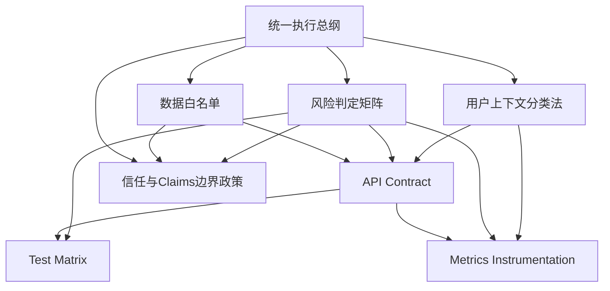
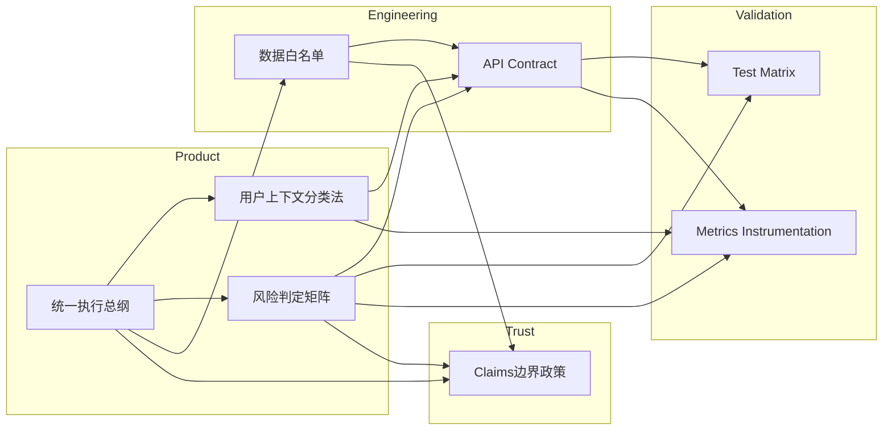

# VitaMe — P0 文档索引 / 依赖关系图

> 日期：2026-04-20  
> 状态：Draft  
> 适用范围：产品、设计、工程、QA、创始人收口讨论  
> 目标：让团队知道“先看什么、以什么为准、哪些文档互相依赖”。

---

## 1. 这份索引怎么用

这 8 份补充文档，不是 8 份平行 PRD，而是一套收口链：

1. 先用 **总纲** 锁定方向  
2. 再用 **上下文分类法 + 风险判定矩阵** 锁定产品与规则  
3. 再用 **API Contract + 数据白名单** 锁定工程边界  
4. 再用 **Test Matrix + Metrics Instrumentation** 锁定验证和埋点  
5. 最后用 **Claims 边界政策** 锁定外部表达与信任边界

当原有文档与这些收口文档冲突时，建议按下面优先级执行：

1. `VitaMe-P0-统一执行总纲.md`
2. `VitaMe-P0-风险判定矩阵.md`
3. `VitaMe-P0-用户上下文分类法.md`
4. `2026-04-20-vitame-p0-api-contract.md`
5. `VitaMe-P0-数据白名单.md`
6. `2026-04-20-vitame-p0-test-matrix.md`
7. `2026-04-20-vitame-p0-metrics-instrumentation.md`
8. `VitaMe-P0-信任与Claims边界政策.md`

---

## 2. 文档清单与角色

| 文件 | 类型 | 解决什么问题 | 主要使用者 |
|---|---|---|---|
| `docs/product/VitaMe-P0-统一执行总纲.md` | Brief | 锁定 P0 唯一定位、主场景、主链路、不做什么 | 创始人 / 产品 / 工程负责人 |
| `docs/product/VitaMe-P0-用户上下文分类法.md` | Taxonomy | 定义问什么、什么时候问、什么时候不问 | 产品 / 交互 / 后端 |
| `docs/product/VitaMe-P0-风险判定矩阵.md` | Decision Matrix | 定义红黄灰绿、证据层级、结果合并和 CTA | 产品 / 后端 / QA / 医学审核 |
| `docs/superpowers/specs/2026-04-20-vitame-p0-api-contract.md` | Contract | 锁定对象、字段、接口和错误码 | 前后端 / Claude Code |
| `docs/superpowers/specs/2026-04-20-vitame-p0-test-matrix.md` | Test Matrix | 锁定黄金样例、回归测试、Demo 验收 | QA / 产品 / 工程 |
| `docs/superpowers/specs/2026-04-20-vitame-p0-metrics-instrumentation.md` | Metrics Spec | 锁定事件、漏斗、激活、回访与看板口径 | 产品分析 / 前后端 |
| `docs/product/VitaMe-P0-数据白名单.md` | Data Policy | 冻结 P0 真正接哪些源、哪些字段、怎么降级 | 后端 / 数据 / 产品 |
| `docs/product/VitaMe-P0-信任与Claims边界政策.md` | Trust Policy | 定义对外能说什么、不能说什么 | 产品 / 设计 / 运营 / 创始人 |

---

## 3. 推荐阅读顺序

### 对创始人 / 产品负责人
1. `VitaMe-P0-统一执行总纲.md`
2. `VitaMe-P0-风险判定矩阵.md`
3. `VitaMe-P0-用户上下文分类法.md`
4. `VitaMe-P0-信任与Claims边界政策.md`
5. `2026-04-20-vitame-p0-metrics-instrumentation.md`

### 对前后端 / Claude Code
1. `VitaMe-P0-统一执行总纲.md`
2. `VitaMe-P0-用户上下文分类法.md`
3. `VitaMe-P0-风险判定矩阵.md`
4. `2026-04-20-vitame-p0-api-contract.md`
5. `VitaMe-P0-数据白名单.md`
6. `2026-04-20-vitame-p0-test-matrix.md`

### 对 QA / Demo Owner
1. `VitaMe-P0-统一执行总纲.md`
2. `VitaMe-P0-风险判定矩阵.md`
3. `2026-04-20-vitame-p0-api-contract.md`
4. `2026-04-20-vitame-p0-test-matrix.md`
5. `VitaMe-P0-信任与Claims边界政策.md`

---

## 4. 依赖关系图（简版）



---

## 5. 依赖关系图（按交付链路展开）



---

## 6. 每份文档在开发中的“卡点”作用

### A. 总纲
不让项目重新膨胀成：
- 泛健康顾问
- 症状问诊
- 补剂百科
- 导购工具

### B. 用户上下文分类法
不让 Query Intake 变成：
- 想到什么问什么
- 同一输入每次追问不一致
- 高风险场景漏问关键字段

### C. 风险判定矩阵
不让 Safety Judgment 变成：
- 红黄灰绿全凭 prompt
- 多个风险不会合并
- 无码据也假装安全

### D. API Contract
不让前后端联调变成：
- 字段漂移
- 状态不一致
- 错误处理不统一

### E. 数据白名单
不让数据接入变成：
- 不断扩源
- 标准化失控
- 覆盖范围假大空

### F. Test Matrix
不让“看起来差不多能跑”冒充可上线

### G. Metrics Instrumentation
不让 Aha / Activation / Trust 只停留在口头概念

### H. Claims 边界政策
不让产品逐渐被说成：
- 诊断工具
- 治疗工具
- 绝对安全背书
- 品牌推荐工具

---

## 7. 建议的审批顺序（superpowers 风格）

参考 superpowers 的“先结构化计划，再执行，再验证”的思路，这 8 份文档适合按下面顺序冻结：

### Gate 1：方向冻结
- `VitaMe-P0-统一执行总纲.md`

### Gate 2：规则冻结
- `VitaMe-P0-用户上下文分类法.md`
- `VitaMe-P0-风险判定矩阵.md`

### Gate 3：工程边界冻结
- `2026-04-20-vitame-p0-api-contract.md`
- `VitaMe-P0-数据白名单.md`

### Gate 4：验证冻结
- `2026-04-20-vitame-p0-test-matrix.md`
- `2026-04-20-vitame-p0-metrics-instrumentation.md`

### Gate 5：对外表达冻结
- `VitaMe-P0-信任与Claims边界政策.md`

---

## 8. 最终建议的目录结构

```text
docs/
├── VitaMe-P0-文档索引-依赖关系图.md
├── product/
│   ├── VitaMe-P0-统一执行总纲.md
│   ├── VitaMe-P0-用户上下文分类法.md
│   ├── VitaMe-P0-风险判定矩阵.md
│   ├── VitaMe-P0-数据白名单.md
│   ├── VitaMe-P0-信任与Claims边界政策.md
│
└── superpowers/
    └── specs/
        ├── 2026-04-20-vitame-p0-api-contract.md
        ├── 2026-04-20-vitame-p0-test-matrix.md
        └── 2026-04-20-vitame-p0-metrics-instrumentation.md
```

---

## 9. 一句话结论

**这 8 份文档不是让项目“更完整”，而是让项目“更不容易跑偏”。**  
真正的顺序不是“先把所有文档写满”，而是：

**先锁方向 → 再锁规则 → 再锁接口 → 再锁验证 → 最后锁对外表达。**
