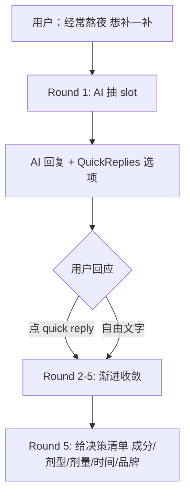
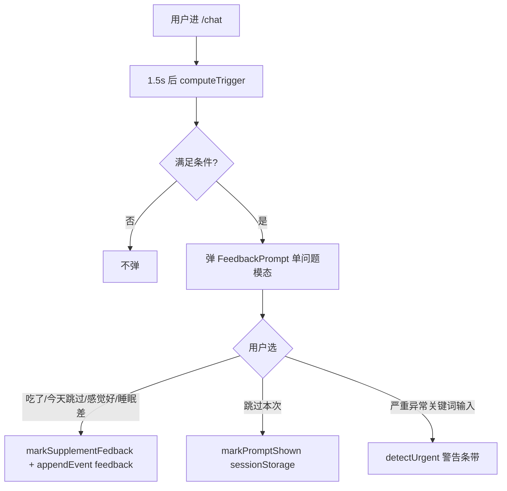
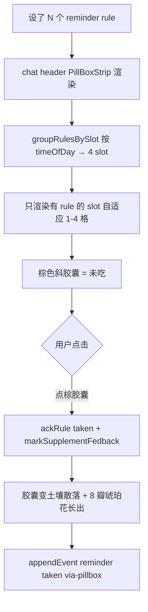

# 用户旅程与 UI 流程

## 0. 入口 + 主导航

**唯一入口**：`/chat`（其他 `/` 路径 redirect 到这里）。

chat header 4 个 icon（左→右）：

```
[Logo]  [我自己 ⌄]  [🔍 AI 看到什么]  [+ 新对话]  [🔔 提醒]  [🕒 Memory]  [⋯ 档案]
                       ↓                    ↓                    ↓                     ↓                  ↓
                   PromptInspector       清当前 person     /reminders         /memory          /profile
                                          的对话历史
```

底部 footer：`AI 仅提供信息参考，不提供诊断或处方`（mini disclaimer）

顶部 `DemoBanner`：`Demo 原型 · 禁忌规则尚未经执业药师临床复核，不构成医疗建议`

---

## 1. 主路径：首访 → 提问

```mermaid
flowchart TD
  A[用户打开 vitame.live] --> B[/chat 主页]
  B --> C{是否有历史对话?}
  C -->|无| D[EmptyState 显示种子 hero + 3 颗种子问题]
  C -->|有| E[加载 conversationStore.messagesByPersonId 当前 person 历史]
  D --> F[用户点种子问题 OR 自己输入]
  E --> F
  F --> G[sendMessage → /api/chat]
```

### 涉及代码

- `src/app/chat/page.tsx` 主页
- `src/components/chat/EmptyState.tsx` 首屏种子图 + 3 个 seed prompt
- `src/lib/chat/conversationStore.ts` 按 personId 隔离历史

### 关键 UI 元素

- **HeroSeedSprout** — 种子发芽插画（北极星 §11.1 第 1 阶段）
- **3 个 seed prompts**（硬编码）：
  - 我妈在吃华法林，能吃辅酶 Q10 吗？
  - 经常熬夜，吃什么补一补？
  - 孕期能补维生素 D 吗？

---

## 2. 主路径：安全检查（高危场景）

```mermaid
flowchart TD
  A[用户输入 鱼油+华法林] --> B[/api/chat]
  B --> C[retrieveFacts 命中 hardcoded contraindication isCritical=true]
  C --> D[criticalBanner 注入 system prompt]
  D --> E[LLM 流式生成 🔴 红警 + 引证]
  E --> F[MessageBubble 渲染 + 客户端 sanitize 禁词]
  F --> G[用户看到红警 + CitationPill 可点]
```

### 触发条件

- KB Retriever 命中 `CONTRAINDICATIONS` 表里 `severity='red'` 的条目
- system prompt 加 `criticalBanner: ⚠️ 【系统提示】本轮检索命中 N 条 isCritical=true 高危组合`

### 预期 LLM 行为

- 输出 🔴 emoji 开头
- 引证 `[来源: VitaMe 内置禁忌 + 美国 AI2 SUPP.AI]`
- 不讨论"折中方案"
- 末尾 disclaimer

### 涉及代码

- `src/lib/chat/retriever.ts` `criticalHits` 计数
- `src/lib/chat/systemPrompt.ts` § 安全红线 + Few-shot 示例 4
- `src/lib/db/contraindications.ts` 硬编码 critical 表

---

## 3. 主路径：选品 5 轮收敛



### 多轮收敛策略（systemPrompt 显式定义）

| 轮 | 任务 |
|---|---|
| 1 | 抽主诉 + 关键 slot（年龄段 / 性别 / 主要症状或目标）|
| 2 | 确认现有用药/疾病/特殊状态（如 `<user_profile>` 已有则跳过）|
| 3 | 给 2-3 个候选成分 + 简要原因 |
| 4 | 基于选定成分给剂型 + 剂量范围 + 时间 + 候选品牌 |
| 5 | 处理疑问 → 决策清单 |

### QuickReplies 触发

末尾连续编号行 → 渲染成可点击 chip（PersonSwitcher 风格）。3 策略 fallback parser：

1. **严格编号列表**：`1. xxx\n2. xxx\n3. xxx`
2. **末尾「还是」二选一**：`A 还是 B?` 自动拆 2 chips
3. **加粗 → 列表**：`**X** → ...` 连续行（minimax 偏好）

附加 2 个固定行：
- `4. 其他（自己说）` 展开内联输入框
- `5. 跳过 · 你帮我选` 直接发"都可以，你帮我选吧"

### 涉及代码

- `src/components/chat/QuickReplies.tsx` 3 策略 + 2 附加行
- `src/components/chat/MessageList.tsx` 仅最末助手消息且非 streaming 才显示

---

## 4. 主路径：对话内设提醒（tool use）

```mermaid
flowchart TD
  A[用户: 鱼油每天 8 点提醒我] --> B[/api/chat with tools]
  B --> C[LLM 决定调 create_reminder]
  C --> D[Stream 出 tool-call part]
  D --> E[useChat onToolCall 触发]
  E --> F{currentSupplements 有鱼油?}
  F -->|无| G[addSupplement 自动加]
  F -->|有| H[复用已有 supplementId]
  G --> I[addRule timeOfDay 08:00]
  H --> I
  I --> J[appendEvent reminder rule-created via-chat]
  J --> K[addToolResult]
  K --> L[sendAutomaticallyWhen → 服务端继续]
  L --> M[LLM 写 ✓ 已设...确认句]
  M --> N[chat header PillBox strip 出现]
```

### Tool 定义

```ts
chatTools.create_reminder: tool({
  description: '为当前 active person 的某保健品创建每日吃药提醒...',
  inputSchema: z.object({
    supplementMention: z.string(),
    timeOfDay: z.string().regex(/^([01]\d|2[0-3]):[0-5]\d$/),
    daysOfWeek: z.array(z.number().int().min(1).max(7)).optional(),
  }),
  // 没有 execute → 客户端 useChat onToolCall 处理
})
```

### 防误判 / 防重复

- prompt 铁律：时间不明先反问，不要瞎填默认
- 高危组合（华法林+鱼油等）先警告再说提醒
- 已有同 supplement 的 rule 时 LLM 应提示用户而非创建第 2 条

### 涉及代码

- `src/lib/chat/tools.ts` tool schema
- `src/app/api/chat/route.ts` `streamText({ tools, stopWhen: stepCountIs(2) })`
- `src/app/chat/page.tsx` useEffect 监听 `tool-create_reminder` part 状态

---

## 5. 主路径：服用反馈 ritual



### 触发条件（triggerRule.ts）

- `currentSupplements.length > 0`
- 距 `lastFeedbackAt` ≥ 24h
- 当前 sessionStorage 没标记 `prompt-shown`

### 3 类问题（随机选 1）

- `taken` — "今天的 X 你吃了吗？"
- `feeling` — "最近吃 X，感觉怎么样？"
- `time-adjust` — "X 当前提醒在 8 点，需要换时间吗？"

### 严重异常关键词硬拦截

URGENT_KEYWORDS = `['剧痛', '呼吸困难', '出血', '过敏休克', '晕倒', '抽搐', '昏迷', '心悸严重']`
触发后 prompt 顶部红条带显示「请优先就医」。

### 涉及代码

- `src/lib/feedback/triggerRule.ts`
- `src/components/feedback/FeedbackPrompt.tsx`
- `src/app/chat/page.tsx` useEffect 1.5s delay

---

## 6. 主路径：Pill Box × Seed (Reminder UI)



### Slot 分桶

- 早 04:00–11:00
- 中 11:00–16:00
- 晚 16:00–21:00
- 睡前 21:00–04:00（跨午夜）

不动 ReminderRule 数据模型（任意 timeOfDay 仍合法），仅渲染层 bucket。

### 视觉契约

- 默认棕胶囊（斜 -22°，破"炸弹"感）
- acked 后：**5 颗土块散落 + 茎 + 1 片侧叶 + 8 瓣 #D4933A 琥珀花 + #8B5A2B 棕花心**
- 8 瓣花原版来自 v0.2 `SeedSproutStage`（Kevin 4 阶段品牌物件）

### 涉及代码

- `src/components/brand/PillBox.tsx` Strip + Full + SoilMound + Pill
- `src/components/brand/SeedSproutStage.tsx` 4 阶段图标 + `renderBloomInline`
- `src/lib/reminder/slot.ts` timeOfDay → SlotKey
- `src/lib/reminder/store.ts` ackRule

---

## 7. 主路径：多 Person 切换

```mermaid
flowchart TD
  A[chat header 我自己 ⌄] --> B[PersonSwitcher 弹 sheet]
  B --> C[列出所有 Person + 每人 health summary]
  C --> D{选}
  D -->|切到妈妈| E[setActivePersonId mother.id]
  E --> F[useChat key=chat-${id} 实例 reset]
  F --> G[storedMessages 切到妈妈 historyByPersonId.mother]
  G --> H[chat 显示妈妈历史 / PillBox 显示妈妈的 routine]
  D -->|新增家人| I[addPerson + 默认 active]
```

### 关键约束（Codex Finding #1 修复后）

- conversationStore = `messagesByPersonId: Record<string, UIMessage[]>`
- useChat 用 `id: chat-${activePerson.id}` → 切换时实例 reset，messages 重新加载
- 每 person 上限 12 条 UI message ≈ 5-6 轮配对
- 对话历史 / Memory 事件 / Reminder 规则 都按 personId 隔离

### 涉及代码

- `src/components/chat/PersonSwitcher.tsx` + `PersonSwitcherSheet.tsx`
- `src/lib/profile/profileStore.ts` people[]
- `src/lib/chat/conversationStore.ts` messagesByPersonId
- `src/app/chat/page.tsx` useChat key

---

## 8. 主路径：Hermit 周期归纳

```mermaid
flowchart TD
  A[/memory 时间轴累积 5+ 事件] --> B[HermitButton 显示 帮我看看]
  B --> C[用户点击]
  C --> D[POST /api/hermit + events 含 eventId]
  D --> E[LLM 归纳 ≤3 条 observation]
  E --> F[sanitize basedOnEventIds 必须 ⊆ 输入]
  F --> G[appendEvent observation × N]
  G --> H[EventCard 渲染 observation 特殊 UI 含 接受/忽略]
  H --> I{用户}
  I -->|接受| J[appendEvent correction observation-accepted]
  I -->|忽略| K[appendEvent correction observation-dismissed]
```

### 4 类 observationType

- `pattern` — 反馈模式发现
- `recheck` — 提醒用户复查
- `reminder-adjust` — 建议调提醒
- `request-field` — 请求补充字段

### 4 条铁律（prompt 显式禁）

- ❌ 诊断疾病
- ❌ 因果医学归因
- ❌ 自动改用户方案
- ❌ 替代医生

### 涉及代码

- `src/components/memory/HermitButton.tsx`
- `src/app/api/hermit/route.ts`
- `src/components/memory/EventCard.tsx` observation 特殊渲染
- `src/lib/memory/types.ts` ObservationEventMetadata

---

## 9. 边界情况清单

| 情况 | 处理 |
|---|---|
| 首访无 routine | PillBox strip 不渲染（首访 P0 do not render）|
| 设了 reminder 但 supplement 已删 | renderPillsInCell 显示 `(已删除的保健品)` |
| 同一 slot 多 supplement（>2 颗）| 显示 2 颗胶囊 + `+N` 溢出 |
| 跨午夜 timeOfDay (如 23:30) | bucket 进「睡前」slot |
| 切换 person 时正在 streaming | useChat reset；streaming 被中断（无害）|
| LocalStorage 满 / 浏览器清空 | 数据丢失（v0.4 接受此风险，P3 加云端）|
| extract 失败 | fire-and-forget，仅 stderr 记录，verify event 仍 append |
| Hermit 调用失败 | UI 显示「归纳失败：{msg}」，不写任何 event |

---

**事实源**：`src/app/chat/page.tsx` + `src/app/{profile,memory,reminders}/page.tsx` + `src/components/chat/*` + `src/components/brand/*`
